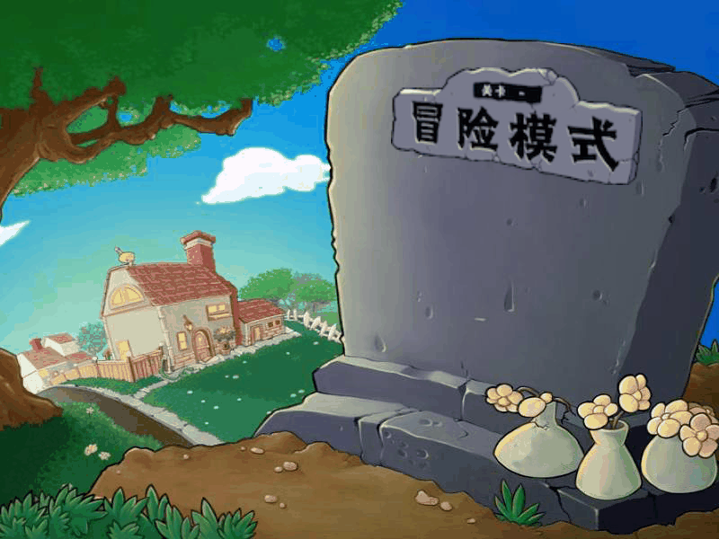
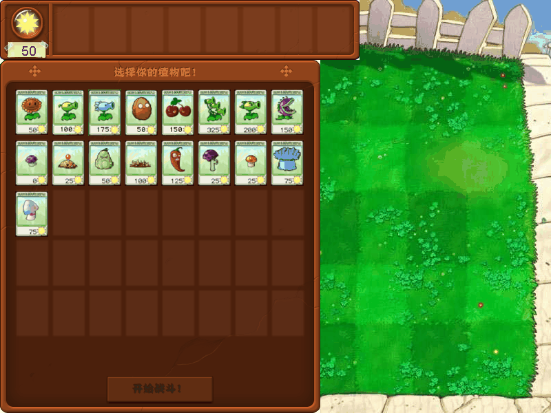
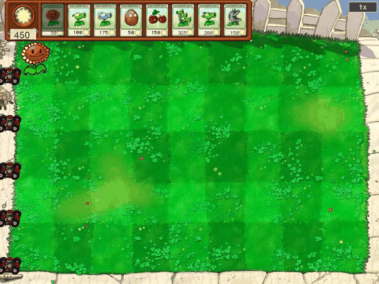
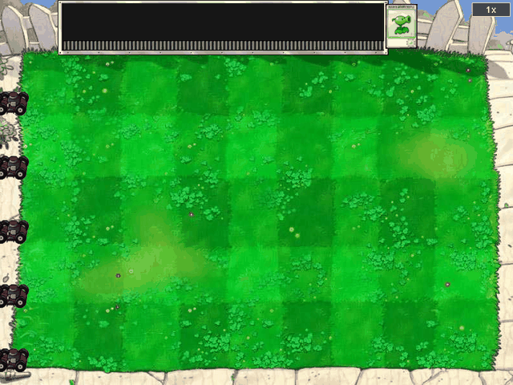
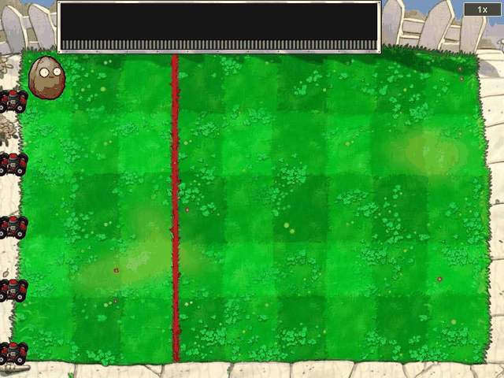
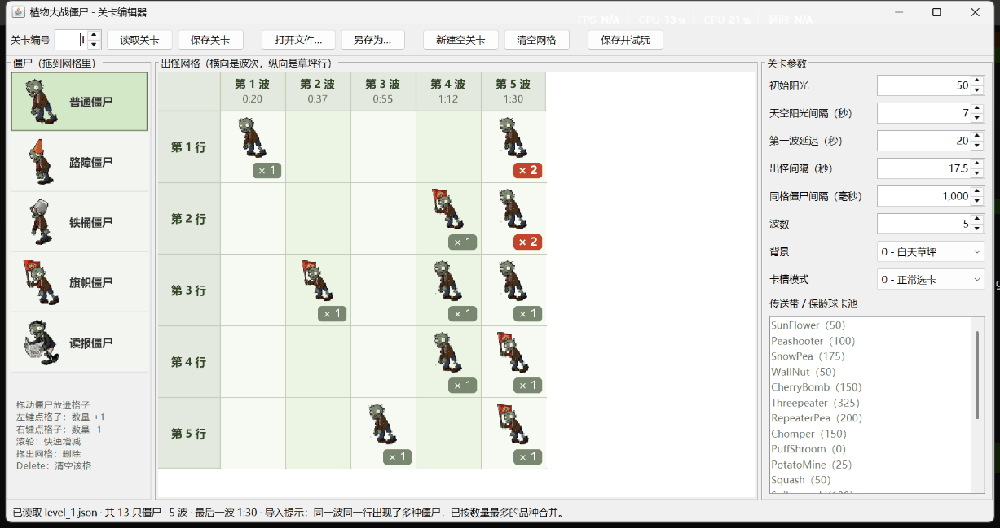

# 植物大战僵尸（Java 版）

# 简介（README.md）

这是一款使用 **Java (Swing)** 编写的植物大战僵尸，目前不仅包含了冒险模式的基础玩法，还有传送带和坚果保龄球两种特殊关卡。

**【注意】本项目代码较为简单（大一~大二作品），可供参考，但不允许商用、抄袭。**

作者：**Windy-Field / Octorange（同一人）**

> **特别说明**：
> 1. 由于**版权问题**，资源包请**主动联系作者**获取：3519936734@qq.com；
> 2. 当前版本较为原始，部分卡片功能仍在开发中，个别植物的行为、动画或数值与预期可能存在差异，后续会逐步完善。

## 游戏截图

| 主菜单 | 选卡界面 |
| --- | --- |
|  |  |

| 经典关卡 | 传送带关卡 |
| --- | --- |
|  |  |

| 坚果保龄球关卡 | 关卡编辑器 |
| --- | --- |
|  |  |

## 功能概览（v1.2）

- 目前一共制作了 6 个关卡（第 1~6 关），通关后自动进入下一关。最后一关通关后，回到主菜单，关卡进度重置为第 1 关；
- 经典关卡开始前需从 17 张候选卡中挑（最多）8 张放入卡槽（**卡槽数量可在编辑器里调低**）；
- 已完成阳光掉落与收集动画、卡片冷却、小推车防线等基础机制；
- 传送带关卡（卡片随机送出，不花阳光）和坚果保龄球关卡；
- 右上角设置了 1x / 2x / 3x 加速按钮；
- **GUI 关卡编辑器：拖动僵尸编排每一波出怪，调节初始阳光、阳光生成速度和出怪速度，还能指定某格随机行出怪、禁用或必选某些植物、限制卡槽数量。**

## 运行环境

- 最好是 **Windows** 系统（启动脚本基于 PowerShell），其余系统不保证能正常运行。
- **JDK 17 或更高版本**
- 首次运行需联网，脚本会自动下载并校验 JSON 解析库 Gson 2.11.0，之后可离线运行

> 只是**想玩**、不想装 Java 的话，可以直接用打包好的免安装版，见下方「分发给朋友（免安装版）」。

## 准备资源包

再次提醒：资源包**不随代码分发**（原因见上方特别说明），但**仍可联系作者邮箱发布**。

拿到资源包后，解压到 `java/assets`，至少要有这些子目录：

```text
java/assets/
├── Cards/      卡片图片
├── Map/        关卡背景
├── Plants/     植物动画
├── Screen/     菜单、按钮等界面图片
├── Zombies/    僵尸动画
├── bullets/    子弹图片
└── levels/     关卡配置 level_0.json ~ level_5.json（内部编号 0~5，显示为第 1~6 关）
```

放好后可以先运行一次 `run.bat test`，检查素材是否齐全。

## 快速开始

**双击运行**：双击 `java/run.bat`，自动编译并从第 1 关开始。也可以在命令行带参数：

```bat
run.bat            :: 从第 1 关开始
run.bat 3          :: 从第 (3+1) 关开始（参数 0~5 对应第 1~6 关）
run.bat test       :: 运行自检
run.bat editor     :: 打开关卡编辑器（默认第 1 关）
run.bat editor 3   :: 打开关卡编辑器并载入第 4 关
```

**PowerShell**：在**根目录**执行 `.\java\build.ps1`，可加 `-Level 5`、`-Test`、`-Editor`。

**IntelliJ IDEA**：用 IDEA 打开 `java` 文件夹，等 Maven 导入完成后：

- 游玩游戏：运行 `src/main/java/pvz/Main.java`；
- 编辑关卡：运行 `src/main/java/pvz/EditorMain.java`。

运行配置的工作目录必须是 `java` 文件夹（IDEA 默认就是），否则找不到 `assets`。

## 自检

`run.bat test` 会在不开窗口的情况下运行 `SelfCheckTest`，检查**素材能否读取、植物资料表是否对齐、关卡文件格式是否正确、选卡和种植流程能否走通、编辑器存盘再读回是否一致**等问题。
全部通过时输出 `PASS`，**并把各画面的截图存到 `build` 目录**。

【注意】自检会借用 `assets/levels/level_99.json` 当临时文件，跑完即删；**这个编号已被占用时会停下来提醒，不会覆盖。**

## 分发给朋友（免安装版）

朋友电脑上没装 Java、也不想折腾环境时，用打包脚本做一个**自带运行时的绿色免安装包**：

```powershell
.\package.ps1
```

脚本会依次做完这些事：编译源码 → 生成 `game.jar` → 用 `jlink` 裁一份只含 `java.desktop` 的精简运行时（约 45MB）→ 把游戏、素材、运行时组装进 `dist/MyPVZ` → 压成 `dist/MyPVZ.zip`。

（调试时加 `-SkipPackage` 可以跳过最后一步压缩，只组装文件夹；加 `-Name 自定义名` 可以改包名。）

打包结果：

```text
dist/MyPVZ/                 解压后就是这个文件夹，约 92MB
├── play-game.bat           ← 朋友双击这个就能玩
├── level-editor.bat        ← 双击打开关卡编辑器
├── diagnose.bat            打不开时双击它看详细报错
├── readme.txt              给玩家看的简版说明
├── game.jar
├── gson-2.11.0.jar
├── jre/                    精简 Java 运行时，约 45MB
└── assets/                 素材，约 47MB
```

**朋友那边只需要做一件事：解压，双击 `play-game.bat`。** 不需要装 Java，不需要联网。

> **为什么文件名是英文的**：中文文件名在部分解压工具下会解出乱码，命令行里的引号转义也更麻烦。文件名用 ASCII、内容用中文，是兼容性最好的组合。批处理内容必须用 **GBK** 编码写出（cmd.exe 按系统代码页逐字节解析 `.bat`，中文 Windows 默认就是 GBK，写成 UTF-8 会乱码且 `chcp` 救不回来）；`readme.txt` 则用**带 BOM 的 UTF-8**，记事本靠 BOM 识别编码。

几点说明：

- 压缩包约 **73MB**，走网盘比走聊天软件更稳妥（部分聊天软件对文件大小有限制）。
- 对方从网上下载后首次运行，Windows 可能弹「未知发布者」提示，点**仍要运行**即可。
- 启动脚本开头会 `cd /d "%~dp0"` 切到自身所在目录，所以整个 `MyPVZ` 文件夹**可以随意改名、放桌面或拷进 U 盘**。
- 编辑器保存的关卡写在发行包自己的 `assets/levels/` 里，**不会影响你仓库中的素材**。
- **打包前请确认 `assets` 里有你自己的关卡改动**，发行包是 `assets` 的完整快照。
- `dist/` 已加入 `.gitignore`，打包产物不会误提交进仓库。

## 关卡编辑器


窗口网格横向是波次，纵向是草坪的 5 行；格子可表示"这一波、这一行"出哪种僵尸、出几只。

| 操作 | 说明 |
| --- | --- |
| 从左边把僵尸拖进格子 | 放上这种僵尸 |
| 左键 / 右键点格子 | 选中该格，不改僵尸数量 |
| Ctrl + 左键 / Ctrl + 右键 | 僵尸数量 -1 / +1 |
| 滚轮 | 快速增减僵尸数量 |
| 把格子拖到别的格子 | 移动；**目标格有内容时交换** |
| 把格子拖出网格，或选中后按 Delete | 删除该格僵尸 |
| 选中格子后按 R，或勾选左边「随机行出怪」 | **此格的僵尸随机在该波的某一行出现** |

右侧参数列表中，「天空阳光间隔」就是阳光生成速度，「出怪间隔」就是出怪速度。**阳光间隔只对白天草坪的选卡关卡起作用。**

「卡槽数量」决定这一关玩家最多能带几张卡，可选 1~8，默认 8。**这是个上限而不是固定值**，玩家仍可以带更少的卡开局；调低之后，选卡界面选满这个数才会出现「开始战斗」按钮。

「传送带 / 保龄球卡池」「禁用植物」「必选植物」均可自定义植物：

- **传送带/保龄球卡池只适用于传送带/保龄球关卡**，正常选卡关卡用不到。
- **禁用 / 必选只对正常选卡关卡生效**，禁用的植物在选卡界面保留卡位、显示为灰色锁定，点不动；必选的植物在进入选卡界面时自动飞进卡槽，玩家取消不掉。
- **必选张数不能超过卡槽数量**，两份清单也不能出现同一种植物，存盘前都会提醒。

【注意】禁用的植物同样要占用候选区的位置，所以**禁用 + 必选之后剩下的植物必须够填满卡槽**，否则玩家凑不齐卡数、开始按钮永远不会亮。编辑器会在存盘前拦下这种关卡；万一关卡文件被手工改成了这种样子，游戏只会放下装得进的必选植物，保证玩家仍然能开局。

「保存关卡」会写回 `assets/levels/level_N.json`；「保存并试玩」则会另开一个游戏窗口跑这一关，
关掉试玩窗口不影响编辑器。

关卡编号落在现有关卡范围之外时（但允许紧接着的下一关），「保存关卡」会变灰，只能用「另存为…」存到别处。

## 特殊操作说明

| 操作 | 说明 |
| --- | --- |
| 鼠标右键 | 取消手中的卡片 |
| 点击右上角倍速按钮 | 切换 1x、2x、3x 速度 |

## 项目结构

源码按主题分成 6 个包：

```text
src/main/java/pvz/
├── Main.java             游戏入口
├── EditorMain.java       关卡编辑器入口
├── plant/                植物 —— 改植物只看这里（外加 Assets 登记动画）
│   ├── Cards.java            植物资料表：名字、卡片图、花费、冷却
│   ├── PlantRules.java       植物分类：射手 / 一次性 / 近身 / 夜间
│   ├── PlantActions.java     植物每一帧的行为：产阳光、开火、爆炸、吞食……
│   ├── Plant.java            植物对象，血量和初始状态
│   └── Card.java             一张卡片（卡槽、传送带、选卡飞行）
├── zombie/               僵尸
│   ├── Zombie.java           僵尸对象：血量、速度、各状态的动画
│   └── ZombieSpawn.java      一条出场记录：第几毫秒、第几行、什么僵尸
├── game/                 游戏主循环
│   ├── Game.java             总控：鼠标输入、出怪、僵尸行为、子弹、胜负
│   ├── GameState.java        一局游戏里所有会变的数据
│   ├── GameRenderer.java     把 GameState 画出来
│   └── GameScreen.java       菜单 / 选卡 / 游戏中等画面的编号
├── level/                关卡文件
│   ├── Level.java            一个关卡的内容
│   └── LevelLoader.java      把关卡 JSON 读成 Level
├── world/                公共底座
│   ├── Assets.java           图片和动画的加载，"动画名 → 文件"对照表
│   ├── Layout.java           所有坐标、时间常量
│   ├── Sprite.java           草坪上会动的东西的基类
│   └── Bullet.java / Sun.java / Car.java   子弹、阳光、小推车
└── editor/               关卡编辑器
    ├── LevelEditor.java      主窗口，兼拖放协调者
    ├── LevelDesign.java      波次网格数据和关卡文件读写
    ├── EditorGrid.java / EditorPalette.java   出怪网格 / 僵尸列表
    ├── CheckListPanel.java   一列可打勾的植物清单
    └── EditorIcons.java / EditorDragController.java   图标缓存 / 拖放接口
```

**主要关系：**

- **逻辑、数据与画面**：`Game` 每帧把植物交给 `PlantActions`，自己处理僵尸和子弹，然后让 `GameRenderer` 画出来。

- **继承关系**：`Plant`、`Zombie`、`Bullet`、`Sun` 继承 `Sprite`（位置、血量、当前动画）。

- **关卡**：`LevelLoader` 把 JSON 读成 `Level`，`Game.loadLevel()` 再摊进 `GameState`。编辑器用 `LevelDesign` 读写同一份 JSON，这是游戏和编辑器之间唯一的接口。

- **编辑器拖放**：网格和僵尸列表都只认 `EditorDragController` 接口，由 `LevelEditor` 实现并居中协调。

## 新增 / 修改植物示例

### 只改数值

| 改什么 | 改哪里 |
| --- | --- |
| 花费、冷却 | `plant/Cards.java` 的 `COST`、`COOLDOWN` |
| 血量 | `plant/Plant.java` 构造函数（默认 5，坚果 30） |
| 射速、产阳光间隔、土豆雷出土时间等 | `world/Layout.java` 里对应的常量 |
| 攻击范围、子弹种类等行为细节 | `plant/PlantActions.java` 里对应的方法（见下文） |

### 新增一种植物

以新增一个"寒冰双发射手"为例：

1. **准备素材**：把植物**动图**放进 `assets/Plants/…`，卡片图放进 `assets/Cards/`。

2. **登记动画**：`world/Assets.java` 的 `loadPlants()` 里加一行`animation("植物名", "Plants/…/1.gif");`。有额外状态（睡觉、爆炸等）的，每个状态各登记一个动画。新的卡片图在 `loadCards()` 里登记。

3. **注册资料表**：`plant/Cards.java` 的 `PLANTS`、`PICTURES`、`COST`、`COOLDOWN` 四个数组**同一位置**各加一项，插在最后两个保龄球之前。选卡界面的卡片数量会自动跟着变。

4. **归类**：如果行为和某类现有植物相同，在 `plant/PlantRules.java` 对应名单里加上名字即可：

   | 名单 | 特性 | 行为 |
   | --- | --- | --- |
   | `SHOOTER_PLANTS` | 同行有僵尸就开火 | `updateShooter`、`fireBullets`、`bulletNameFor` |
   | `INSTANT_PLANTS` | 种下播完动画就生效，然后消失 | `updateInstant`、`triggerInstantEffect` |
   | `CLOSE_ATTACK_PLANTS` | 僵尸走到身上才生效 | `updateCloseAttack`、`handleCloseHit` |
   | `NIGHT_PLANTS` | 白天睡觉（需要登记"植物名Sleep"动画） | `Plant` 构造函数 |

  **【注意】产阳光的向日葵类植物需要写在 `PlantActions.dispatchPlant()` 开头的名字判断里。**

5. **特殊行为**（可选）：套路全新、归不进上面任何一类时，在 `PlantActions.dispatchPlant()` 加一个分支，再写一个自己的处理方法即可。
同类里只有少许差别（比如子弹换一种）时，在上表对应方法里加一个名字判断就够了。

6. **自检**：**强烈建议添加完成后运行`run.bat test`进行自检。**当四个数组项数不一致、忘了登记动画或缺卡片图时，都会在自检时报出来。

新增僵尸的思路基本类似：`world/Assets.java` 的 `loadZombies()` 登记各状态动画，`zombie/Zombie.java` 设置血量和速度。

若想让编辑器也能放该种类僵尸，还需再加进 `editor/LevelDesign.java` 的 `ZOMBIE_KINDS` 和 `ZOMBIE_LABELS`。

## 额外技术说明

- 画面仅用 Java(Swing) 绘制，不依赖于任何游戏引擎；
- 动画是通过直接读取 GIF 动图逐帧播放的；
- 关卡配置采用 JSON 格式，由 Gson 解析；
- 碰撞检测用矩形相交，碰撞范围取整段动画可见像素的总范围，避免僵尸啃食时来回抖动；
  僵尸的碰撞范围再去掉前面探出的脑袋和手臂（`Layout.ZOMBIE_FRONT_TRIM_PERCENT` 等），只算躯干，这样啃食和豌豆溅射都发生在身体上。

## 常见问题

| 现象 | 解决办法 |
| --- | --- |
| 提示"找不到素材目录 assets" | **先联系作者**，再按"准备资源包"一节把素材放到 `java/assets` 下 |

## 版权与许可

本项目**源代码**采用 [CC BY-NC 4.0](https://creativecommons.org/licenses/by-nc/4.0/)
（署名 - 非商业性使用 4.0 国际）许可协议，详见 [LICENSE](LICENSE)。

简单说：你可以自由地学习、修改和分享这份代码，但要**保留作者署名**，并且**不能用于商业用途**。

作者：**Windy-Field / Octorange**（3519936734@qq.com）

> **注意**：本许可只覆盖源代码，**不包含游戏素材**。
> 图片、动画、音频等素材版权归其原始权利人所有，不随代码分发（见 `.gitignore` 中的 `assets/`）。
> 想运行本项目请自行准备合法来源的素材。
