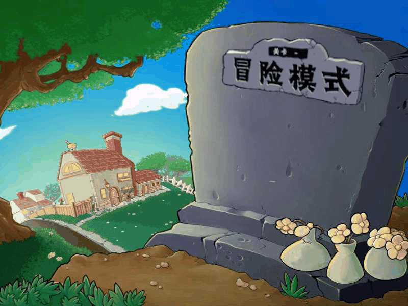
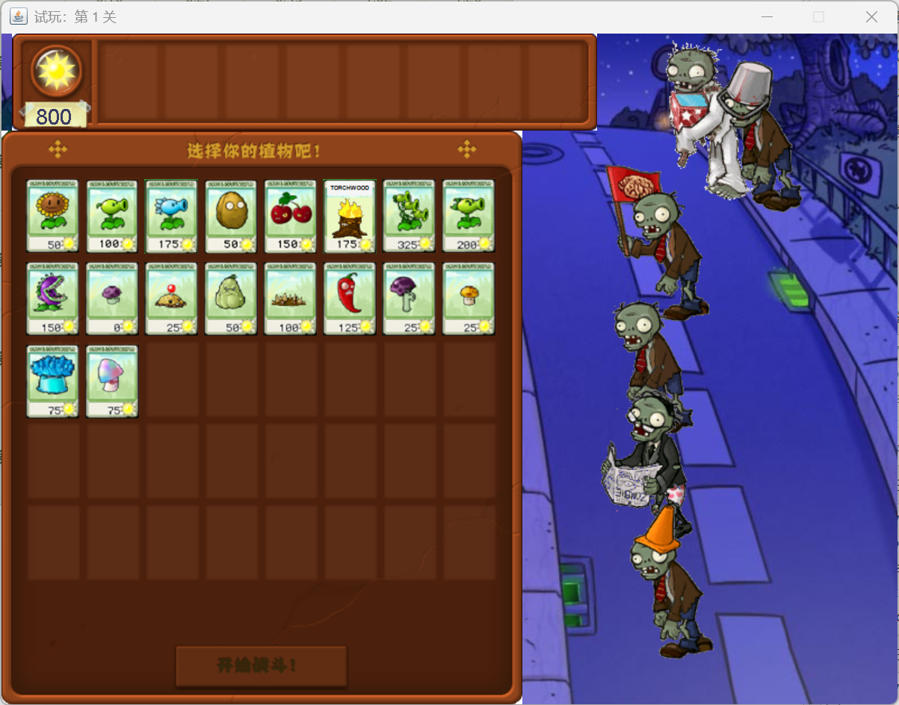
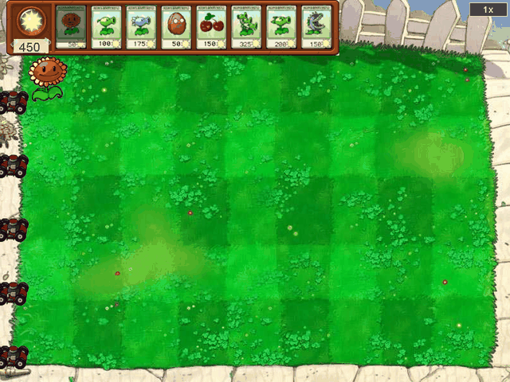
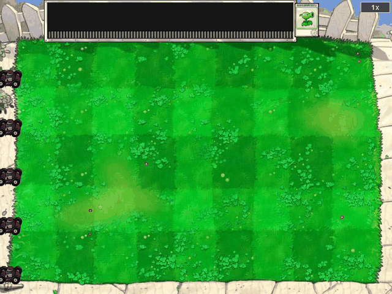
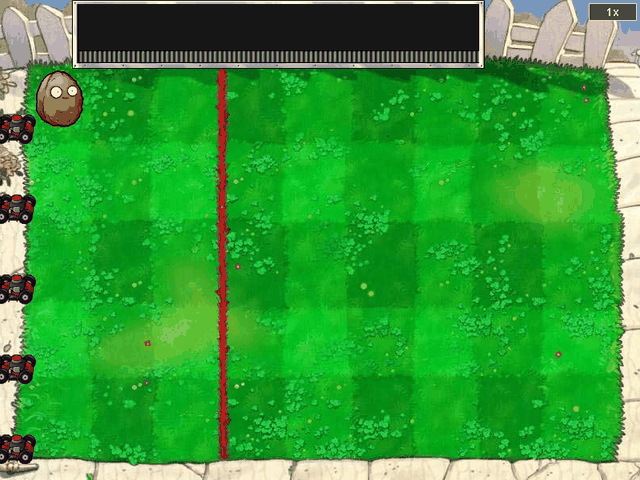
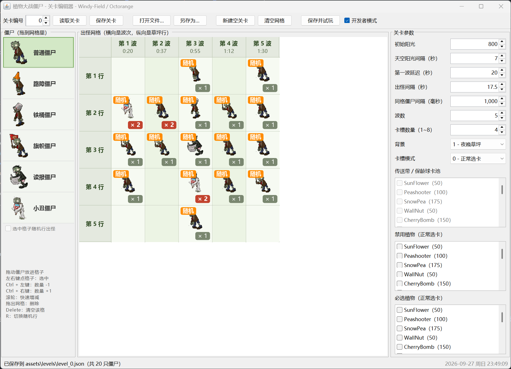

# 植物大战僵尸（Java 版）

这是一个使用 Java Swing 编写的植物大战僵尸学习项目。项目包含冒险模式、传送带关卡、坚果保龄球关卡和图形化关卡编辑器，适合学习 Java 桌面程序、游戏循环、动画播放、碰撞检测和 JSON 文件读写。

本项目代码规模较小，非常适合大一~大二阅读、参考。

**本项目仅能用于学习，禁止商用，严禁抄袭！**

作者：**Windy-Field / Octorange**

## 游戏截图

| 主菜单 | 选卡界面 |
| --- | --- |
|  |  |

| 经典关卡 | 传送带关卡 |
| --- | --- |
|  |  |

| 坚果保龄球关卡 | 关卡编辑器 |
| --- | --- |
|  |  |

## 当前版本

### V1.8

- 增加铲子卡槽。点击植物可以移除植物，点击空草坪格会自动收回铲子，右键可以取消操作。
- 增加橄榄球僵尸。它使用 `assets/Zombies/FootballZombie/` 下的动画，移动速度为每个固定步长 1.5 像素；缺少专属掉头动画时会使用普通僵尸动画。
- 优化窝瓜攻击。窝瓜仍在所在行的左、中、右三格内索敌，并优先锁定距离最近的僵尸；砸下时会攻击锁定目标左右各半格范围内、躯干与范围相交的僵尸。
- 清理植物和僵尸的公共逻辑，删除未使用的字段、常量和重复方法。

### V1.7

- 增加双发向日葵。每次生产阳光时会生成两颗阳光。
- 将植物的产阳光数量写入 `PlantDefinition`，并继续整理植物资料和行为代码。

### V1.6

- 增加火炬树桩、火焰豌豆和子弹转换规则。
- 普通豌豆经过火炬树桩后会变成火焰豌豆；冰豌豆经过火炬树桩后会恢复为普通豌豆。

### V1.5 及更早版本

- 增加 1x、1.5x、2x 三档战斗速度，并使用固定时间步长推进战斗。
- 增加小丑僵尸、传送带关卡、坚果保龄球关卡和图形化关卡编辑器。
- 增加开场演出、阳光收集、卡片冷却和小推车防线等基础机制。

## 运行环境

- 建议使用 Windows 系统。启动脚本使用 PowerShell，其他系统不保证能够正常运行。
- 需要 JDK 17 或更高版本。
- 项目自带 Gson 2.11.0，文件位于 `lib/gson-2.11.0.jar`，无需单独下载。
- 游戏需要仓库根目录下的 `assets/` 素材目录。

## 快速开始

请在仓库根目录中运行以下命令：

```bat
run.bat            :: 从第 1 关开始
run.bat 3          :: 从第 4 关开始，参数 0~5 对应第 1~6 关
run.bat test       :: 运行自检
run.bat editor     :: 打开关卡编辑器并载入第 1 关
run.bat editor 3   :: 打开关卡编辑器并载入第 4 关
```

也可以直接使用 PowerShell：

```powershell
.\build.ps1
.\build.ps1 -Level 5
.\build.ps1 -Test
.\build.ps1 -Editor -Level 3
```

脚本会自动暂存、提交、同步远程提交并推送。遇到冲突、未登录 GitHub 或远程地址不正确时会停止，不会强制覆盖远程内容。

使用 IntelliJ IDEA 时，请打开仓库根目录，并将运行配置的工作目录设置为仓库根目录。IDEA 会根据 `pom.xml` 使用 `lib/gson-2.11.0.jar`。

游戏入口是 `src/main/java/pvz/Main.java`，编辑器入口是 `src/main/java/pvz/EditorMain.java`。

## 素材目录

```text
assets/
├── Cards/       植物卡片
├── Map/         关卡背景
├── Plants/      植物动画
├── Screen/      菜单和界面图片
├── Zombies/     僵尸动画
├── bullets/     子弹图片
├── new_assets/  新增的特殊素材
└── levels/      关卡文件 level_0.json ~ level_5.json
```

素材缺失或损坏时，请运行 `run.bat test`。自检程序会检查素材、资料表、动画和关卡文件是否能够正常使用。

## 自检程序

`run.bat test` 会在不打开游戏窗口的情况下运行 `SelfCheckTest`。它会检查以下内容：

- 界面图片、背景、植物素材和僵尸素材；
- 植物与僵尸资料表、卡片、动画和基础行为；
- 橄榄球僵尸的速度、动画和死亡流程；
- 窝瓜的索敌、锁定目标和多目标压扁范围；
- 铲子、传送带、保龄球、选卡、种植和出怪流程；
- 关卡编辑器的保存、读取和游戏侧加载；
- 游戏渲染结果和固定时间步长。

全部通过时，程序会输出 `PASS`，并把测试画面保存到 `build/`。自检会临时使用 `assets/levels/level_99.json`，使用前会检查该文件是否已经存在，结束后会删除临时文件。

## 关卡编辑器


编辑器的网格横向表示波次，纵向表示草坪的 5 行。每个格子表示某一波在某一行出现的僵尸以及出现数量。

| 操作 | 作用 |
| --- | --- |
| 将僵尸拖入格子 | 在格子中添加僵尸 |
| 点击格子 | 选中格子 |
| Ctrl + 左键 / Ctrl + 右键 | 减少 / 增加僵尸数量 |
| 滚轮 | 快速调整僵尸数量 |
| 将格子拖到其他格子 | 移动内容；目标格有内容时会交换 |
| 将格子拖出网格或按 Delete | 删除格子中的僵尸 |
| 按 R 或勾选“随机行出怪” | 让这一波的僵尸随机选择行 |

编辑器可以设置初始阳光、阳光生成间隔、出怪间隔、卡槽数量、卡池、禁用植物和必选植物。卡槽数量的范围是 1~8；禁用植物和必选植物只对正常选卡关卡生效。

点击“保存并试玩”可以在新窗口中运行当前关卡。勾选“开发者模式”后，试玩画面会显示碰撞箱、血量和场上对象数量；该设置不会写入关卡文件。

## 游戏操作

| 操作 | 作用 |
| --- | --- |
| 点击植物卡片，再点击草坪 | 种植植物 |
| 点击铲子，再点击植物 | 移除植物 |
| 点击空草坪格 | 收回铲子 |
| 鼠标右键 | 取消手中的卡片或铲子 |
| 点击右上角速度按钮 | 切换 1x、1.5x、2x 战斗速度 |

## 项目结构

```text
src/main/java/pvz/
├── Main.java                     游戏入口
├── EditorMain.java               关卡编辑器入口
├── plant/                        植物资料、卡片和行为
│   ├── BulletTransformation.java 子弹转换资料
│   ├── Card.java                 卡片对象
│   ├── Cards.java                卡槽卡片生成
│   ├── CloseAttackActions.java   近战与保龄球植物行为
│   ├── InstantPlantActions.java  一次性植物行为
│   ├── Plant.java                植物对象
│   ├── PlantActionType.java      植物行为类别
│   ├── PlantActions.java         植物行为调度
│   ├── PlantCatalog.java         植物资料表
│   ├── PlantDefinition.java      单种植物资料
│   ├── ShooterActions.java       射手植物行为
│   ├── SunProducerActions.java   产阳光植物行为
│   └── WallNutActions.java       坚果裂纹行为
├── zombie/                       僵尸资料、出场和效果
│   ├── Zombie.java               僵尸对象
│   ├── ZombieCatalog.java        僵尸资料表
│   ├── ZombieDefinition.java     单种僵尸资料
│   ├── ZombieEffects.java        僵尸死亡和特殊效果
│   └── ZombieSpawn.java          僵尸出场记录
├── game/                         游戏流程和战斗系统
│   ├── CombatSystem.java         战斗对象更新
│   ├── Game.java                 游戏主流程与输入处理
│   ├── GameRenderer.java         游戏画面绘制
│   ├── GameScreen.java           游戏画面状态
│   ├── GameState.java            当前游戏数据
│   └── LevelSystem.java          关卡出怪和通关流程
├── level/                        关卡数据和 JSON 读写
│   ├── Level.java                关卡数据
│   ├── LevelJson.java            关卡 JSON 格式约定
│   └── LevelLoader.java          读取关卡文件
├── world/                        素材、坐标和公共对象
│   ├── Assets.java               图片与动画加载
│   ├── Bullet.java               子弹对象
│   ├── Car.java                  小推车对象
│   ├── Layout.java               坐标、时间、血量、伤害和界面常量
│   ├── Sprite.java               游戏对象基类
│   └── Sun.java                  阳光对象
├── tools/
│   └── AssetToolkit.java         图片处理工具
└── editor/                       关卡编辑器
    ├── CheckListPanel.java       植物选择列表
    ├── EditorDragController.java 拖放控制接口
    ├── EditorGrid.java           出怪网格
    ├── EditorIcons.java          编辑器图标
    ├── EditorPalette.java        僵尸选择面板
    ├── LevelDesign.java          关卡数据和文件读写
    └── LevelEditor.java          编辑器主窗口

src/test/java/pvz/
├── DeveloperModeTest.java        开发者模式画面检查
└── SelfCheckTest.java            项目自检程序
```

项目遵循以下规则：

- `PlantCatalog` 和 `ZombieCatalog` 保存植物、僵尸的固定资料。品种差异应优先写入资料表，不要在多个类中重复判断名称。
- `Layout` 保存坐标、时间、血量、伤害和界面布局常量；`LevelJson` 保存关卡 JSON 的字段约定。
- `PlantActions`、`CombatSystem` 和 `LevelSystem` 分别处理植物行为、战斗过程和关卡流程。
- 新增品种时应优先复用已有的资料类和行为处理器，只有通用规则无法表达时才新增类。

## 新增植物示例

下面以新增“寒冰双发射手”为例。新增植物时，应先复用已有的植物资料和行为，再补充确实缺少的代码。

### 必做步骤

1. 将基础动画和状态动画放入 `assets/Plants/寒冰双发射手/`。
2. 将卡片图片放入 `assets/Cards/`，并让文件名与 `PlantDefinition.cardPicture` 一致。
3. 在 `world/Assets.java` 的 `loadPlants()` 中登记动画。普通动画使用 `animation()`，序列动画使用 `sequence()`，需要拉伸的动画使用 `stretchedAnimation()`。
4. 在 `plant/PlantCatalog.java` 中增加一条完整的 `PlantDefinition`，填写名称、卡片、花费、冷却、血量、睡眠状态、可被吃状态、行为类别、产阳光数量、绘制偏移、攻击动画和子弹转换资料。
5. 为植物选择已有的 `PlantActionType`。只有现有行为处理器无法表达新规则时，才新增处理器。
6. 在 `SelfCheckTest.java` 的动画名单中加入新动画。若植物会进入传送带或保龄球卡池，还要准备对应卡片并加入相关检查。
7. 运行 `run.bat test`，确认素材、资料表、卡片、渲染和行为检查全部通过。

### 可选步骤

- 植物需要睡眠动画时，准备 `植物名Sleep`，并在 `PlantDefinition` 中设置 `sleepsAtDay`。
- 植物需要特殊绘制位置时，在 `PlantDefinition` 中设置 `rootShift` 或 `verticalShift`。
- 植物需要攻击保护时，在 `PlantDefinition` 中设置 `attackAnimation`。
- 植物需要特殊子弹时，在 `assets/bullets/` 或 `assets/new_assets/` 中准备素材，并登记 `BulletTransformation`。
- 植物需要新的射击高度时，再修改 `Layout.java` 和 `ShooterActions.java`。

### 植物行为类别

| 类别 | 行为处理器 | 说明 |
| --- | --- | --- |
| `SUN_PRODUCER` | `SunProducerActions` | 产生阳光 |
| `SHOOTER` | `ShooterActions` | 向同一行的僵尸发射子弹 |
| `INSTANT` | `InstantPlantActions` | 播放一次动画后立即生效 |
| `CLOSE_ATTACK` | `CloseAttackActions` | 僵尸进入近距离后发动攻击 |
| `WALL_NUT` | `WallNutActions` | 根据血量切换裂纹动画 |

## 新增僵尸

1. 将僵尸动画放入 `assets/Zombies/` 或 `assets/new_assets/`。
2. 在 `world/Assets.java` 的 `loadZombies()` 中登记行走、攻击、死亡和特殊动作动画。
3. 在 `zombie/ZombieCatalog.java` 中增加一条 `ZombieDefinition`，填写血量、装备、速度和动画名称。
4. 如果缺少专属动画，将对应字段设为 `null`，让通用规则复用已有动画。
5. 在 `SelfCheckTest.java` 中加入新动画并运行 `run.bat test`。

编辑器会自动读取 `ZombieCatalog` 中的僵尸名单，不需要另外修改编辑器名单。

## 制作免安装包

如果目标电脑没有 Java，可以在仓库根目录运行：

```powershell
.\package.ps1
```

脚本会编译游戏、生成 `game.jar`、使用 `jlink` 制作精简运行时，并生成 `dist/MyPVZ`。玩家解压后双击 `play-game.bat` 即可运行，不需要安装 Java 或联网。

调试打包过程时，可以使用以下参数：

```powershell
.\package.ps1 -SkipPackage
.\package.ps1 -Name CustomName
```

`-SkipPackage` 会跳过最后的压缩步骤，`-Name` 可以修改输出目录名称。`dist/` 已加入 `.gitignore`，不会被提交到仓库。

## 技术说明

- 游戏使用 Java Swing 绘制，不依赖游戏引擎。
- 动画通过读取 GIF 的逐帧图像播放。
- 关卡使用 JSON 文件保存，并由 Gson 解析。
- 植物、僵尸和子弹使用矩形碰撞检测；僵尸还会单独计算躯干碰撞范围。
- 游戏使用固定时间步长推进战斗，因此不同速度下的规则仍保持一致。

## 常见问题

| 问题 | 处理方法 |
| --- | --- |
| 找不到 `assets` | 确认已经完整克隆仓库，并从仓库根目录运行程序 |
| 找不到 Gson | 确认 `lib/gson-2.11.0.jar` 存在，并重新加载 Maven 项目 |
| IDEA 找不到素材 | 将运行配置的工作目录设置为仓库根目录 |
| 自检失败 | 根据错误信息检查对应的素材、资料表或关卡文件 |

## 版权与许可

项目源代码采用 [CC BY-NC 4.0](https://creativecommons.org/licenses/by-nc/4.0/) 许可协议，详见 [LICENSE](LICENSE)。

你可以学习、修改和分享源代码，但必须保留作者署名，且不得用于商业用途。

作者：**Windy-Field / Octorange**（3519936734@qq.com）

许可协议只适用于源代码，不适用于图片、动画和音频等游戏素材。素材版权归原始权利人所有，请勿将素材用于商业用途。
